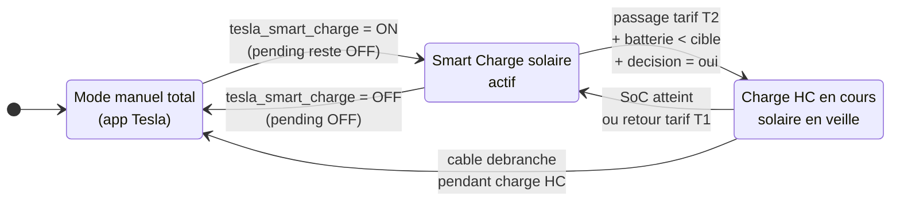
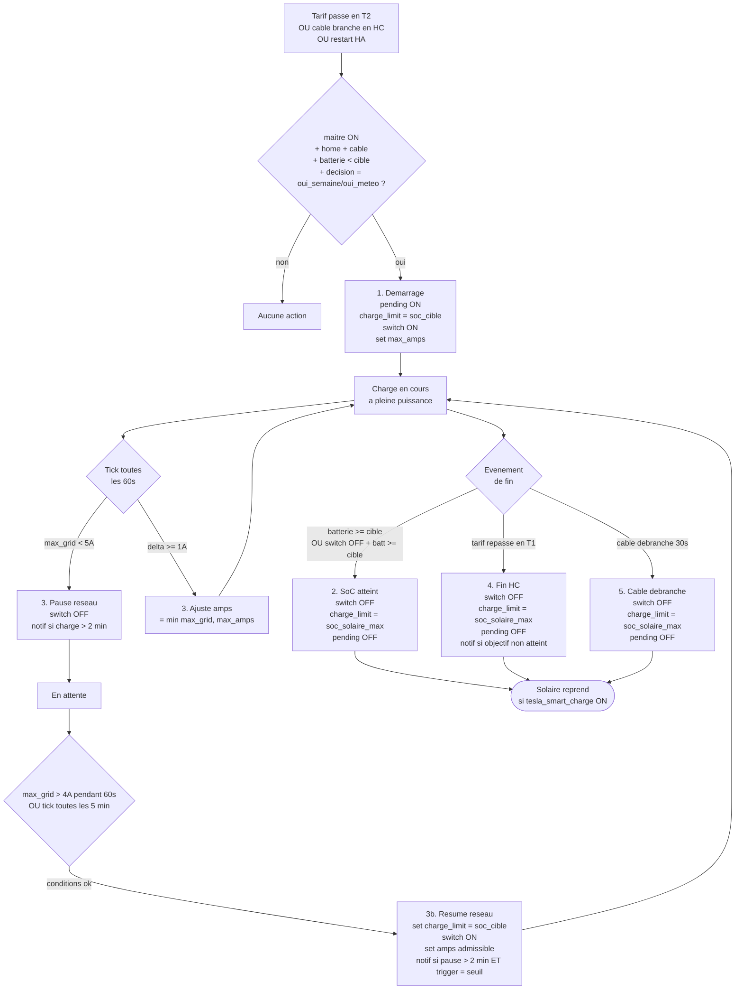

# Tesla Smart Charge

## Vue d'ensemble

Le systeme de recharge intelligente adapte en temps reel l'amperage de charge de la Tesla Model Y "F.R.I.D.A.Y" en fonction du surplus solaire disponible. L'objectif est de maximiser l'autoconsommation solaire et minimiser le soutirage reseau.

## Diagrammes

### 1. Matrice d'etats : qui controle la charge ?

Deux `input_boolean` determinent le mode actif. `tesla_smart_charge` est le maitre absolu (intention utilisateur), `tesla_night_charge_pending` est le verrou operationnel pose par la charge HC.



### 2. Flux decisionnel Smart Charge solaire

Les 10 automations du mode solaire s'enchainent autour de trois triggers (intention, evenement vehicule, surplus). Toutes partagent les gardes `tesla_smart_charge = on`, `pending = off`, `home`, sauf la protection reseau qui reagit plus vite. (Les automations 0, 0b, 0c et 0d sont des refreshs declencheurs, hors mode solaire.)

```mermaid
flowchart TD
    Start([Evenement]) --> Trig{Type de trigger}

    Trig -->|toggle ON| A1[1. Activation]
    Trig -->|cable branche 30s<br/>OR vitesse > 0<br/>OR surplus > 2A pendant 1 min| A3[3. Demarrage auto]
    Trig -->|trappe fermee 1 min<br/>OR vitesse < 1 pendant 1 min<br/>OR amps < 1 pendant 1 min| A4[4. Arret auto]
    Trig -->|optimized_amp stable 30s| A5[5. Suivi amperage]
    Trig -->|surplus < 5A pendant 3 min<br/>OR switch ON depuis 3 min| A6[6. Pause solaire]
    Trig -->|surplus > 4A pendant 3 min| A7[7. Resume solaire]
    Trig -->|P1 > tesla_grid_limit - 500W<br/>pendant 10s| A8[8. Protection reseau]
    Trig -->|cable debranche 30s<br/>OR sun -> below_horizon| A9[9. Reset limite SoC max solaire]
    Trig -->|tesla_soc_solaire_max change| A10[10. Sync helper SoC max]
    Trig -->|charge_current change| A11[11. Refresh apres set amps<br/>delay 10s + update_entity<br/>mode restart]
    Trig -->|arrivee home<br/>OU connexion WiFi| A0[0/0b. Refresh donnees<br/>3 min ou 1 min 30]

    A1 --> CondSurplus{surplus >= 5A<br/>+ batterie < limite<br/>+ cable + home<br/>+ charge off ?}
    CondSurplus -->|oui| DoStart[set charge_limit = soc_solaire_max<br/>switch ON<br/>set 5A<br/>Awtrix + notif]
    CondSurplus -->|non| NotifWait[1b. Notif<br/>en attente du soleil]

    A3 --> DoStart
    A4 --> DoStop[switch OFF<br/>Awtrix + notif<br/>+ refresh]
    A5 --> CondDelta{delta >= 1A<br/>ET cooldown 60s ?}
    CondDelta -->|oui| SetAmps[set amps<br/>= clamp(opt, 5, tesla_max_amps)]
    A6 --> CondLow{charge on<br/>ET surplus < 5A ?}
    CondLow -->|oui| Pause[switch OFF]
    A7 --> CondResume{charge off<br/>ET home ?}
    CondResume -->|oui| Resume[set charge_limit = soc_solaire_max<br/>switch ON<br/>+ set amps optimal]
    A8 --> CondGrid{max_grid < 5A ?}
    CondGrid -->|oui| GridPause[switch OFF + notif<br/>protection reseau]
    CondGrid -->|non| GridReduce[set amps = max_grid]

    A9 --> CondReset{limite != soc_solaire_max<br/>ET pending = off ?}
    CondReset -->|oui| DoReset[set charge_limit = soc_solaire_max + notif]

    A10 --> CondSync{pending = off ?}
    CondSync -->|oui| DoSync[set charge_limit = nouvelle valeur]
    DoSync --> CanRelaunch{maitre on + cable + home<br/>+ charge off + bat < limite<br/>+ surplus >= 5A ?}
    CanRelaunch -->|oui| Relaunch[switch ON + set amps optimal<br/>+ notif charge relancee]
    CanRelaunch -->|non| NotifOnly[notif limite mise a jour]
```

### 3. Cycle de vie Charge Nocturne HC

La charge HC est pilotee par le tarif du P1 Meter HomeWizard (T1 = HP, T2 = HC). Le flag `tesla_night_charge_pending` met les automations solaires en veille tant qu'il est actif.



## Entites Tesla (Fleet API)

### Entites utilisees dans la config actuelle

| Entite | Type | Description |
|---|---|---|
| `switch.f_r_i_d_a_y_charge` | switch | Demarre/arrete la charge. **Sert aussi d'indicateur d'etat** : on = charge en cours |
| `number.f_r_i_d_a_y_charge_current` | number | Regle l'amperage cible (5-32A). **Valeur commandee** utilisee par les templates (plus fiable que le sensor API, polling 30-60 s) |
| `sensor.f_r_i_d_a_y_charger_current` | sensor | Amperage reel de charge (A). Lecture API Fleet, utilise seulement par le trigger `amps_too_low` de l'automation 4 |
| `sensor.f_r_i_d_a_y_niveau_de_batterie` | sensor | Niveau batterie (%) |
| `sensor.f_r_i_d_a_y_vitesse_de_charge` | sensor | Vitesse de charge |
| `sensor.f_r_i_d_a_y_charging` | sensor | Statut de charge (Charging, Stopped, Disconnected, Complete...) |
| `number.f_r_i_d_a_y_charge_limit` | number | Limite de charge configuree (%) |
| `device_tracker.f_r_i_d_a_y_location` | device_tracker | Position (home/away) |
| `binary_sensor.f_r_i_d_a_y_charge_cable` | binary_sensor | Cable de charge branche (on = connected) |
| `cover.f_r_i_d_a_y_trappe_de_charge` | cover | Trappe de charge (ouvrir/fermer) |
| `sensor.f_r_i_d_a_y_charger_power` | sensor | Puissance de charge instantanee (kW). Lue par `sensor.power_tesla` (×1000 → W) |

### Entites Fleet API disponibles mais NON utilisees

L'integration Tesla Fleet expose de nombreuses entites supplementaires qui pourraient servir aux automatisations energie :

#### Charge et batterie

| Entite (probable) | Type | Description |
|---|---|---|
| `sensor.f_r_i_d_a_y_battery_range` | sensor | Autonomie estimee (km) |
| `sensor.f_r_i_d_a_y_charge_energy_added` | sensor | Energie ajoutee cette session (kWh) |
| `sensor.f_r_i_d_a_y_charge_rate` | sensor | Vitesse de charge (km/h ajoutes) |
| `sensor.f_r_i_d_a_y_charger_voltage` | sensor | Tension chargeur (V) |
| `sensor.f_r_i_d_a_y_time_to_full_charge` | sensor | Temps restant pour charge complete (h) |
| `sensor.f_r_i_d_a_y_usable_battery_level` | sensor | Niveau batterie utilisable (%) |
| `binary_sensor.f_r_i_d_a_y_charge_cable` | binary_sensor | Cable branche oui/non |
| `binary_sensor.f_r_i_d_a_y_scheduled_charging_pending` | binary_sensor | Charge programmee en attente |
| `lock.f_r_i_d_a_y_charge_cable_lock` | lock | Verrou du cable de charge |

#### Climat

| Entite (probable) | Type | Description |
|---|---|---|
| `climate.f_r_i_d_a_y_climate` | climate | Climatisation (pre-conditionnement) |
| `climate.f_r_i_d_a_y_cabin_overheat_protection` | climate | Protection surchauffe habitacle |
| `sensor.f_r_i_d_a_y_inside_temperature` | sensor | Temperature interieure (C) |
| `sensor.f_r_i_d_a_y_outside_temperature` | sensor | Temperature exterieure (C) |
| `switch.f_r_i_d_a_y_defrost` | switch | Degivrage |
| `select.f_r_i_d_a_y_seat_heater_*` | select | Sieges chauffants (front L/R, rear L/R/C) |

#### Securite et controle

| Entite (probable) | Type | Description |
|---|---|---|
| `lock.f_r_i_d_a_y_door_lock` | lock | Verrou portes |
| `switch.f_r_i_d_a_y_sentry_mode` | switch | Mode sentinelle |
| `binary_sensor.f_r_i_d_a_y_user_present` | binary_sensor | Utilisateur present dans le vehicule |
| `button.f_r_i_d_a_y_flash_lights` | button | Flash des phares |
| `button.f_r_i_d_a_y_honk_horn` | button | Klaxon |
| `cover.f_r_i_d_a_y_frunk` | cover | Coffre avant |
| `cover.f_r_i_d_a_y_trunk` | cover | Coffre arriere |
| `update.f_r_i_d_a_y_*` | update | Mise a jour logicielle |

### Commandes Fleet API (actions/services)

Au-dela des entites, le Tesla Fleet API expose des **commandes directes** utilisables via `tesla_fleet.` ou via les services HA standards :

#### Commandes de charge

| Commande API | Service HA equivalent | Description |
|---|---|---|
| `charge_start` | `switch.turn_on` sur charge | Demarre la charge |
| `charge_stop` | `switch.turn_off` sur charge | Arrete la charge |
| `set_charging_amps` | `number.set_value` sur charge_current | Modifie l'amperage (0-32A) |
| `set_charge_limit` | `number.set_value` sur charge_limit | Modifie la limite SoC (50-100%) |
| `charge_port_door_open` | `cover.open_cover` | Ouvre la trappe |
| `charge_port_door_close` | `cover.close_cover` | Ferme la trappe |

#### Commandes de planification (firmware >= 2024.26)

| Commande API | Description |
|---|---|
| `set_scheduled_charging` | Programme une charge (enable, time en min depuis minuit). **Deprecie depuis 2024.26** |
| `set_scheduled_departure` | Programme un depart (heure, precond, off-peak). **Deprecie depuis 2024.26** |
| `add_charge_schedule` | **Nouveau** : Ajoute un planning de charge (jours, heure debut/fin, localisation) |
| `remove_charge_schedule` | **Nouveau** : Supprime un planning de charge |
| `add_precondition_schedule` | **Nouveau** : Ajoute un planning de pre-conditionnement |
| `remove_precondition_schedule` | **Nouveau** : Supprime un planning de pre-conditionnement |

Les nouvelles commandes `add_charge_schedule` / `add_precondition_schedule` (firmware 2024.26+) permettent :
- **Multiples plannings** par localisation (Maison, Travail, etc.)
- **Jours specifiques** de la semaine
- **Heure de debut ET de fin** (utile pour arreter avant les heures pleines)
- **Recurrent ou ponctuel**
- Remplacement de l'ancien systeme `set_scheduled_charging`/`set_scheduled_departure`

#### Commandes climat

| Commande API | Description |
|---|---|
| `auto_conditioning_start` | Demarre la climatisation a distance |
| `auto_conditioning_stop` | Arrete la climatisation |
| `set_temps` | Regle la temperature cible |
| `set_preconditioning_max` | Pre-conditionnement max (degivrage) |

#### Commandes navigation

| Commande API | Description |
|---|---|
| `navigation_gps_request` | Envoie des coordonnees GPS au vehicule |
| `navigation_sc_request` | Navigue vers un Supercharger |
| `navigation_request` | Envoie une adresse au vehicule |

### Input booleans

- **`input_boolean.tesla_smart_charge`** : Maitre absolu — active/desactive TOUTE la recharge automatique (solaire ET HC). OFF = mode manuel total via l'app Tesla.
- **`input_boolean.awtrix_toggle_tesla_charge`** : Active l'affichage charge sur Awtrix

## Algorithme de calcul du surplus

Defini dans `template_sensors/tesla_smart_charge.yaml` :

**Installation triphasee** : le Wall Connector Tesla est branche sur les 3 phases (3x230V sans neutre). L'app Tesla affiche "3" pendant la charge. La puissance reelle est donc :

```
P_total = sqrt(3) * V_ligne * I_phase    (cos phi ~= 1 pour charge AC Tesla)
I_phase = P_total / (sqrt(3) * V_ligne)
```

A titre de reference : 16A triphase ≈ 6 375 W, 28A triphase ≈ 11 150 W, 40A triphase ≈ 15 930 W (limite installation).

### sensor.tesla_optimized_amp

```
voltage    = tension mesuree P1 meter L1 (defaut 230V)
p1_power   = puissance active P1 totale triphasee (positif=soutirage, negatif=injection)
tesla_amps = number.f_r_i_d_a_y_charge_current (A par phase, commandee HA)
             0 si switch OFF OU cable OFF (valeur obsolete au rebranchement)
sqrt3      = 1.732

tesla_power = sqrt3 * voltage * tesla_amps     # W total triphase
surplus_w   = -p1_power + tesla_power          # W total triphase
optimal_amp = surplus_w / (sqrt3 * voltage)    # A par phase

=> clamp(optimal_amp, 0, max_grid)
   (max_grid integre deja la borne haute input_number.tesla_max_amps)
```

**Note** : plus de garde sur `solar < 50W`. Le signe de `p1_power` suffit a detecter l'injection solaire (pas d'autre injecteur sur l'installation). Quand la charge demarre sans soleil, l'automation 6 la met en pause au bout de 3 min via son 2e trigger (`switch = on depuis 3 min`).

### sensor.tesla_max_amp_grid

```
voltage      = tension mesuree P1 meter L1 (defaut 230V)
p1_power     = puissance active P1 totale triphasee (positif=soutirage, negatif=injection)
tesla_amps   = number.f_r_i_d_a_y_charge_current (A par phase, commandee HA)
               0 si switch OFF OU cable OFF
grid_limit   = input_number.tesla_grid_limit (defaut 15500W, triphase sans neutre 40A)
max_user_amps = input_number.tesla_max_amps (defaut 28A, configurable UI)
margin       = 500W (marge de securite)
sqrt3        = 1.732

tesla_power = sqrt3 * voltage * tesla_amps       # W total triphase
other_power = p1_power - tesla_power             # consommation hors Tesla (W total)
headroom_w  = grid_limit - margin - other_power
max_amps    = headroom_w / (sqrt3 * voltage)     # A par phase

=> clamp(max_amps, 0, max_user_amps)
```

**Choix de `tesla_amps`** : les templates utilisent la valeur **commandee** (`number.f_r_i_d_a_y_charge_current`) plutot que la valeur **lue** (`sensor.f_r_i_d_a_y_charger_current`). Le sensor API Fleet est poll toutes les 30-60 s, ce qui provoque des oscillations dans les calculs. La garde `switch=on ET cable=on` force `tesla_amps = 0` quand la Tesla ne charge pas, pour eviter une valeur obsolete au rebranchement.

**Logique** : Calcule combien d'amperes la Tesla peut consommer sans que le soutirage total depasse la limite du compteur (`input_number.tesla_grid_limit` - 500W marge). La borne haute est `input_number.tesla_max_amps` (defaut 28A, configurable depuis l'UI). Installation triphase sans neutre 40A → max theorique ~15 930W, limite par defaut 15 500W. Utilise comme plafond par `tesla_optimized_amp` et par le suivi amperage nocturne.

### Interaction des deux sensors

`tesla_optimized_amp` utilise un **double plafond** : `min(surplus_solaire, max_grid)`. Ainsi l'amperage ne depasse jamais ni le surplus solaire ni la capacite reseau.

**Logique surplus** : Le surplus disponible correspond a ce que la Tesla consomme deja + ce qu'on injecte dans le reseau (ou - ce qu'on soutire). Divise par la tension, on obtient l'amperage optimal.

## Architecture des automations

Toute la logique est dans un fichier unique : `automation/TeslaSmartCharge.yaml` (13 automations)

### Concepts cles

- **`input_boolean.tesla_smart_charge`** = **maitre absolu** (intention utilisateur) — conditionne toute recharge automatique, solaire ET HC. Jamais modifie par les automations.
- **`input_boolean.tesla_night_charge_pending`** = **verrou operationnel HC** — mis a ON par l'evaluation 21h, remis a OFF a la fin de la charge HC. Les automations solaires le verifient (`= off`) pour se mettre en veille pendant la charge HC sans toucher au maitre.
- **`switch.f_r_i_d_a_y_charge`** = la charge **tourne reellement** (etat)
- **`script.tesla_refresh`** = reveille la voiture et force la mise a jour des capteurs cles (batterie, vitesse de charge, courant). Centralise le pattern wake+delay+update, utilise par 6 automations
- **`script.tesla_update_no_wake`** = force un poll Fleet API sans wake (rafraichit charger_*, charge_limit, charge_cable, status). Utile pour bouton dashboard quand la voiture est deja en ligne — pas de consommation 12V
- Le suivi amperage est toujours actif, ses conditions internes l'empechent d'agir quand la charge est arretee

### Les 15 automations

```
0. Refresh donnees (arrivee a la maison via Fleet API) :
   Trigger: device_tracker.f_r_i_d_a_y_location -> home
   Action: delay 3 min + script.tesla_refresh
   (force un refresh des capteurs Fleet API quand la voiture rentre)

0b. Refresh donnees (connexion WiFi via Netgear) :
   Trigger: device_tracker.tesla_y -> home
   Action: delay 1 min 30 + script.tesla_refresh
   (declenche au plus tot apres l'entree au garage, complete l'auto 0)

0c. Refresh sur saut de conso (desync charge demarree) :
   Trigger: sensor.p1_power_delta_2min > 3000 W
   Conditions: f_r_i_d_a_y_status on + charging != charging/starting
   Action: script.tesla_update_no_wake
   (detecte un demarrage de charge non encore vu par la Fleet API :
    saut de conso maison + voiture awake + API dit pas charge -> poll force)

0d. Refresh sur chute de conso (desync charge arretee) :
   Trigger: sensor.p1_power_delta_2min < -3000 W
   Conditions: f_r_i_d_a_y_status on + location home + charging in charging/starting
   Action: script.tesla_update_no_wake
   (symetrique de 0c : detecte un arret de charge non encore vu par la Fleet API)

input_boolean.tesla_smart_charge (MAITRE)
       |
       +--[ON] + tesla_night_charge_pending=OFF --> 1. Activation solaire
       |            Conditions: home + cable branche + charge off + batterie pas pleine + surplus >= 5A
       |            Si OK --> set charge_limit = tesla_soc_solaire_max
       |                       + switch.turn_on + set 5A + Awtrix + notification
       |            Sinon --> notification "en attente du soleil"
       |
       +--[ON] + tesla_night_charge_pending=ON  --> charge HC active, automations solaires en veille
       |
       +--[OFF]--> 2. Desactivation
                     Condition: HC pending off (ne coupe pas une charge nocturne en cours)
                     Si charge en cours --> switch.turn_off + Awtrix + notification
                     Sinon --> rien

3. Demarrage auto (solaire) :
  Triggers:
    - manual_start   : vitesse_de_charge > 0
    - charger_plugin : charge_cable = on pendant 30s
    - power_available: tesla_optimized_amp > 2 pendant 1 min
  Conditions: maitre on + HC pending off + home + charge off + batterie pas pleine
              + derniere `tesla_smart_charge_pause_solaire` > 5 min
                (anti-doublon : si auto 6 vient de pauser, laisse Resume #7
                 gerer la reprise — seuils plus robustes : 4A pendant 3 min)
  --> script.tesla_refresh + set charge_limit = tesla_soc_solaire_max
      + switch.turn_on + set 5A + Awtrix + notification (message selon trigger.id)

4. Arret auto (solaire) :
  Triggers:
    - charger_plugout: trappe_de_charge = closed pendant 1 min
    - manual_stop    : vitesse_de_charge < 1 pendant 1 min
    - amps_too_low   : charger_current < 1 pendant 1 min
  Conditions: maitre on + HC pending off + charge on
  --> switch.turn_off + Awtrix + notification (message selon trigger.id) + script.tesla_refresh

5. Suivi amperage solaire (state-change avec garde de stabilite) :
  Trigger: sensor.tesla_optimized_amp stable depuis 30s
  Conditions: maitre on + HC pending off + charge on + home + delta >= 1A + cooldown 60s
  --> number.set_value(clamp(optimized_amp, 5, tesla_max_amps))
  Note: reagit en ~30-90s aux vraies variations (nuages, appareils qui demarrent),
        ignore les oscillations courtes. Budget indicatif : 5-15 ordres/h normal,
        30-40 ordres/h par ciel tres variable.

6. Pause solaire :
  Triggers:
    - tesla_optimized_amp < 5 pendant 3 min (surplus qui chute en cours de charge)
    - switch.f_r_i_d_a_y_charge = on depuis 3 min (demarrage sans soleil : pas de transition detectable)
  Conditions: maitre on + HC pending off + charge on + home + tesla_optimized_amp < 5
  --> switch.turn_off (temporaire)

7. Resume solaire :
  Trigger: tesla_optimized_amp > 4 pendant 3 min
  Conditions: maitre on + HC pending off + charge off + home
  --> set charge_limit = tesla_soc_solaire_max + switch.turn_on + set amperage optimal
  Note: re-applique la limite avant turn_on (defense contre une derive
        cote Tesla pendant la pause : commande Fleet API perdue avec
        voiture endormie, modif manuelle via app, etc.).

8. Protection reseau (reaction rapide, charge solaire uniquement) :
  Trigger: template — p1_active_power > (tesla_grid_limit - 500W) pendant 10s
           (defaut 15 500W - 500W = 15 000W)
  Conditions: HC pending off + charge on + home
  Si max_grid < 5A --> pause charge + notification
  Sinon --> reduit amperage au max admissible
  Note: la charge nocturne a sa propre gestion reseau (voir automations 3 et 3b)

9. Reset limite SoC max solaire :
  Triggers:
    - cable    : binary_sensor.f_r_i_d_a_y_charge_cable = off pendant 30s
    - nuit     : sun.sun = below_horizon
  Conditions: limite courante != tesla_soc_solaire_max + HC pending = off
              (filet de securite : ne touche pas une limite HC en cours)
  --> set charge_limit = tesla_soc_solaire_max + notification (raison)
  Note: sun.sun plutot que tarif T2 — la HC midi (11h-17h) ne doit pas
        resetter la limite alors que le surplus est encore exploitable.
        L'opportunisme "monte a 90% si excedent" a ete supprime au profit
        du helper configurable : si l'utilisateur veut capter plus de
        surplus, il met tesla_soc_solaire_max a 90% directement.

10. Sync helper tesla_soc_solaire_max :
  Trigger: state change input_number.tesla_soc_solaire_max
  Condition: HC pending = off
  --> set charge_limit = nouvelle valeur du helper
  --> si maitre on + cable + home + charge off + batterie < limite + surplus >= 5A
      → switch.turn_on + set amps optimal + notif "charge relancee"
      sinon → notif "limite mise a jour"
  Note: relance immediate sans hysteresis (intention utilisateur explicite).
        Bloquee pendant HC : la HC utilise tesla_soc_cible, le helper sera
        applique automatiquement par les auto 2/4/5 a la fin HC.

11. Refresh donnees apres set amperage (utilitaire, mode: restart) :
  Trigger: state change number.f_r_i_d_a_y_charge_current
  --> delay 10s + homeassistant.update_entity sur :
      number.charge_current, number.charge_limit, sensor.charger_current,
      sensor.charger_power, sensor.niveau_de_batterie
  Note: poll Fleet API sans wake (la voiture est forcement online pendant
        une charge active). mode: restart pour ne refresh qu'une fois si
        plusieurs set_value s'enchainent. Detecte aussi les modifs externes
        (app Tesla, ecran tactile) qui remontent au polling.
```

## Protections integrees

| Protection | Mecanisme |
|---|---|
| **Rate-limit Fleet API** | Suivi solaire : trigger stable 30s + cooldown 60s. Suivi nocturne : tick 60s + delta ≥ 1A |
| **Anti-flapping** | Hystéresis 3 min avant pause/resume |
| **Micro-ajustements** | Commande envoyee seulement si delta >= 1A |
| **Minimum amperage** | 5A minimum (contrainte Tesla) |
| **Maximum amperage** | 28A maximum (limite installation, configurable via `input_number.tesla_max_amps`) |
| **Pas de soleil** | Detection via le signe de `p1_power` (negatif = injection). Si la charge demarre sans surplus, l'automation 6 la met en pause au bout de 3 min (trigger `switch=on depuis 3 min`) |
| **Geolocalisation** | Uniquement quand la voiture est a la maison |
| **Limite compteur** | `sensor.tesla_max_amp_grid` plafonne l'amperage a la capacite reseau (`tesla_grid_limit` - 500W marge) |
| **Protection rapide** | Automation 8 reagit en < 20s si soutirage > (`tesla_grid_limit` - 500W marge), defaut 15 000W |
| **Arret HC precis au %** | Auto 1 force `charge_limit = soc_cible` au demarrage HC : la voiture s'arrete nativement a la cible (independant du polling Fleet API). La limite est restauree a `tesla_soc_solaire_max` par les auto 2/4/5 a la fin HC |

## Affichage Awtrix

L'automation **Awtrix Tesla Charging** affiche sur l'afficheur LED :
- Amperage actuel de charge
- Barre de progression : % batterie / limite de charge configuree
- Icone Tesla (1018)

## Flux de donnees

```
[P1 Meter]     --> active_power + active_voltage_l1 --|-----> sensor.tesla_max_amp_grid
[HA commande]  --> number.f_r_i_d_a_y_charge_current --|            |
                   (garde: switch=on ET cable=on sinon 0)           |
                                                       v            v
                                     sensor.tesla_optimized_amp (double cap: solaire + reseau)
                                                  |
                                5. Suivi amperage (state-change + 30s stable, cooldown 60s) --- normal
                                8. Protection reseau (10s) --- urgence (> 14 500W)
                                                  |
                                number.set_value (number.f_r_i_d_a_y_charge_current)
                                                  |
                                            [Tesla Fleet API]
```

`sensor.solar_total` (defini dans `power_and_energy.yaml` avec unique_id `sensor.solar_total_power` mais entity_id derive du nom) sert uniquement aux notifications. Il n'intervient plus dans le calcul de l'amperage optimal — le signe de `p1_power` suffit.

## Charge HC (heures creuses)

### Contexte

- **Semaine** : la voiture est au travail en journee, pas de charge solaire possible → charge HC si batterie < SoC cible
- **Weekend** : la voiture est a la maison → charge solaire en journee, charge HC seulement si previsions solaires insuffisantes
- **Detection HC/HP** : basee sur le tarif actif du P1 Meter HomeWizard (`sensor.p1_meter_3c39e7284d28_active_tariff`), pas sur des horaires codes en dur. Valeur 1 = HP (T1), valeur 2 = HC (T2)
- **Horaires HC Wallonie 2026** : 22h-07h + 11h-17h (tous les jours). Les deux plages sont utilisees pour la charge (nocturne et midi)

### Input helpers

| Input | Description | Defaut |
|---|---|---|
| `input_number.tesla_soc_cible` | SoC minimum garanti chaque matin (cible HC) | 50% |
| `input_number.tesla_soc_solaire_max` | SoC max en mode solaire (force au demarrage des autos 1/3 SmartCharge) | 90% |
| `input_number.tesla_seuil_solaire` | Production solaire prevue en-dessous de laquelle on charge la nuit | 40 kWh |
| `input_number.tesla_max_amps` | Amperage max de l'installation | 28A |
| `input_number.tesla_grid_limit` | Limite puissance compteur (W) | 15 500W |
| `input_boolean.tesla_night_charge_pending` | Flag : charge nocturne programmee (gere par l'automation) | off |

### Template sensors

Definis dans `template_sensors/tesla_night_charge.yaml` :

| Sensor | Description |
|---|---|
| `sensor.tesla_heures_creuses` | Indique si on est en HC (true/false), base sur le tarif actif du P1 Meter HomeWizard |
| `sensor.tesla_charge_nocturne_necessaire` | Decision : `oui_semaine`, `oui_meteo`, `non`, `non_solaire_suffisant`, `impossible` |
| `sensor.tesla_duree_charge_nocturne_estimee` | Estimation en minutes pour atteindre le SoC cible |

### Automations (automation/TeslaNightCharge.yaml)

Sept automations (6 + 1 sync helper). L'evaluation de `tesla_charge_nocturne_necessaire` se fait **au moment du demarrage** (transition tarif ou branchement en HC), pas a heure fixe. Le flag `pending` est active a ce moment-la et sert de verrou pour les automations solaires.

```
1. Demarrage HC :
  Triggers:
    - tariff  : sensor.p1_meter_3c39e7284d28_active_tariff passe a '2' (HC)
    - cable   : binary_sensor.f_r_i_d_a_y_charge_cable = on pendant 30s
    - restart : homeassistant.event = start
  Conditions: maitre on + tarif=2 + home + cable + batterie < cible
              + (trigger=restart ET pending=on)
                OU sensor.tesla_charge_nocturne_necessaire IN ['oui_semaine','oui_meteo']
  Action: pending ON + script.tesla_refresh
          + number.f_r_i_d_a_y_charge_limit = soc_cible (arret natif Tesla)
          + switch.turn_on + set max_amps + notif
  Note: se declenche sur toutes les plages HC (nocturne et midi).
        Restart HA : reprend la charge si pending etait deja actif.
        La limite Tesla est forcee a la cible : la voiture s'arrete
        nativement (precis au %) sans dependre du polling Fleet API
        (sensor batterie souvent fige la nuit).

2. Arret - SoC atteint :
  Triggers:
    - batt       : sensor batterie >= SoC cible (trigger template)
    - switch_off : switch.f_r_i_d_a_y_charge passe a off
                   (voiture arretee seule a charge_limit native)
  Conditions: pending on + sensor batterie >= SoC cible
              (filtre les pauses reseau et cable debranche)
  Action: switch.turn_off + charge_limit = 80 + pending OFF + notification
  Note: le 2e trigger libere pending des que la voiture s'arrete
        seule, sans attendre le polling du sensor batterie. Critique
        en plage HC midi pour ne pas bloquer le smart charge solaire.

3. Suivi reseau (toutes les 60s) :
  Conditions: pending on + charge on
  Si max_grid < 5A --> pause charge (switch off)
                       Notif uniquement si charge tournait > 2 min
                       (silence les oscillations autour du seuil)
  Sinon si delta >= 1A --> ajuste amperage a min(max_grid, max_amps)
                           (remonte quand la consommation baisse)

3b. Resume reseau :
  Triggers:
    - seuil      : max_grid > 4A pendant 60s (sortie de saturation)
    - periodique : toutes les 5 min (filet de securite)
  Conditions: pending on + charge off + home + tarif HC
  Action: set charge_limit = tesla_soc_cible + switch.turn_on
          + set amperage au max admissible
          Notif uniquement si trigger=seuil ET pause > 2 min
          (silence le filet periodique et les micro-coupures)
  Note: re-applique la cible HC avant turn_on (meme defense que
        SmartCharge auto 7 contre la derive Tesla).

4. Arret - Retour HP :
  Trigger: sensor.p1_meter_3c39e7284d28_active_tariff repasse a '1' (HP)
  Conditions: pending on
  Action: arrete charge si encore en cours + charge_limit = tesla_soc_solaire_max + pending OFF
  Notification si objectif non atteint
  Note: charge_limit restauree par securite (filet si auto 2 ratee).

5. Cable debranche :
  Trigger: binary_sensor.f_r_i_d_a_y_charge_cable = off pendant 30s
  Conditions: pending on
  Action: switch.turn_off + charge_limit = tesla_soc_solaire_max + pending OFF + notification
  Evite que resume reseau tente de relancer en boucle jusqu'a la fin HC.
  Restaure aussi charge_limit a tesla_soc_solaire_max : sinon la prochaine
  charge solaire serait plafonnee a la cible HC.

6. Sync helper tesla_soc_cible :
  Trigger: state change input_number.tesla_soc_cible
  Conditions: pending on
  Action: set charge_limit = nouvelle cible + notification
  Note: bloquee hors charge HC. La nouvelle cible sera utilisee au
        prochain demarrage HC par auto 1.
```

**Avantage du sensor tarif** : les transitions HC/HP sont detectees directement par le compteur P1 Meter HomeWizard. Si les horaires changent cote gestionnaire de reseau, les automations s'adaptent automatiquement sans modification.

**Protection reseau nocturne** : La charge nocturne tourne a pleine puissance (28A). Le suivi reseau (60s) reduit l'amperage si un gros consommateur s'allume. Si la grille est saturee (max_grid < 5A), la charge est mise en pause et le resume reseau la relance des que le surplus revient. L'automation 8 (SmartCharge) est filtree par `HC pending off` — la charge nocturne a sa propre gestion reseau independante.

### Integration avec le smart charge solaire

La cohabitation solaire/HC repose sur `input_boolean.tesla_night_charge_pending` :
- `tesla_smart_charge` (maitre) n'est **jamais modifie** par les automations HC
- Quand `tesla_night_charge_pending = on`, toutes les automations solaires (1, 1b, 2, 3, 4, 5, 6, 7, 8) ont une condition `pending = off` → elles se mettent en veille automatiquement
- Quand la charge HC se termine (SoC atteint ou retour HP), `tesla_night_charge_pending` repasse a off → le smart charge solaire reprend si `tesla_smart_charge` est toujours on
- Le weekend, si la prevision solaire est suffisante (>= seuil), la charge HC ne se declenche pas et le smart charge solaire prend le relais

| `tesla_smart_charge` | `tesla_night_charge_pending` | Mode actif |
|---|---|---|
| OFF | — | Manuel total (app Tesla) |
| ON | OFF | Smart charge solaire |
| ON | ON | Charge HC, solaire en veille |

## Notifications

Les notifications sont envoyees a Fabien via `script.notify_fabien` avec des details enrichis :

| Evenement | Contenu |
|---|---|
| Smart Charge demarre | Raison (cable/solaire/manuel), batterie %, limite %, production solaire W |
| Smart Charge arrete | Raison (debranche/manuel/termine), batterie %, energie ajoutee kWh |
| Smart Charge active/desactive | Batterie %, limite %, production solaire W, energie ajoutee |
| Charge HC demarree | Raison (semaine/meteo), batterie actuelle → cible, amperage, duree estimee, prevision solaire |
| Charge HC SoC atteint | Batterie % |
| Charge HC fin (retour HP) | Batterie %, objectif non atteint si applicable |
| Charge HC pause reseau | Soutirage sature — uniquement si charge tournait > 2 min |
| Charge HC reprise reseau | Duree de pause et amperage — uniquement si pause > 2 min (sortie franche) |
| Charge HC cable debranche | Batterie %, objectif — deconnexion pendant la charge |
| Smart Charge reset limite SoC max | Cable debranche OU coucher du soleil, restaure `tesla_soc_solaire_max`, batterie Y% |
| Smart Charge sync helper SoC max | Helper modifie depuis le dashboard, charge_limit aligne (et charge relancee si conditions OK) |
| Charge HC sync helper SoC cible | Cible HC modifiee pendant charge HC, charge_limit aligne |
| Protection reseau solaire | Soutirage > (`tesla_grid_limit` - 500W), pause charge (solaire uniquement) |

## Pistes d'amelioration restantes

1. **Integration prix spot** : Si tarif dynamique (Belpex), charger quand le prix est bas
2. **Priorite electromenager** : Reduire la charge Tesla quand la machine a laver ou le seche-linge tournent (sensors existants : `binary_sensor.machine_a_laver_en_cours`, `binary_sensor.sechoir_en_cours`)
3. **Historique et stats** : Tracker l'energie chargee en solaire vs reseau via `charge_energy_added`
4. **Pre-conditionnement intelligent** : Utiliser `add_precondition_schedule` ou `auto_conditioning_start` pour chauffer/refroidir l'habitacle avant depart (basee sur le trajet matin Waze)

### Fichiers

| Fichier | Contenu |
|---|---|
| `automation/TeslaSmartCharge.yaml` | Smart charge solaire : 15 automations (incl. refresh WiFi Netgear, refresh sur saut/chute conso, protection reseau, reset + sync helper SoC max, refresh apres set amps) |
| `automation/TeslaNightCharge.yaml` | Charge HC (tarif P1 Meter) : 7 automations (incl. suivi reseau, cable debranche, sync helper cible) |
| `script/tesla_refresh.yaml` | Scripts utilitaires : `tesla_refresh` (wake + update) et `tesla_update_no_wake` (poll Fleet sans wake) |
| `template_sensors/tesla_smart_charge.yaml` | Calcul `sensor.tesla_optimized_amp` et `sensor.tesla_max_amp_grid` |
| `template_sensors/power_and_energy.yaml` | Definit `sensor.solar_total` (unique_id `sensor.solar_total_power`) utilise par les notifs |
| `template_sensors/tesla_night_charge.yaml` | Decision charge HC, detection tarif, duree estimee |
| `automation/AwtrixTeslaCharge.yaml` | Affichage Awtrix |
| `configuration.yaml` | Input helpers (SoC cible HC, SoC max solaire, seuil solaire, max amps, grid limit, flag nocturne) |

### Notes

- Toutes les automations utilisent `device_tracker.f_r_i_d_a_y_location` comme reference de geolocalisation
- Detection cable branche via `binary_sensor.f_r_i_d_a_y_charge_cable`
- Amperage max borne a 28A (limite installation), configurable via `input_number.tesla_max_amps`
- Previsions solaires via integration Forecast.Solar (`sensor.energy_production_tomorrow`)
- Les noms d'entites "probables" dans la section non utilisee doivent etre verifies dans HA (Outils dev > Etats)
