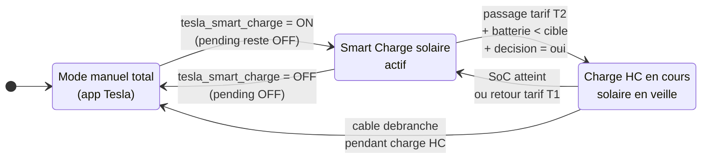
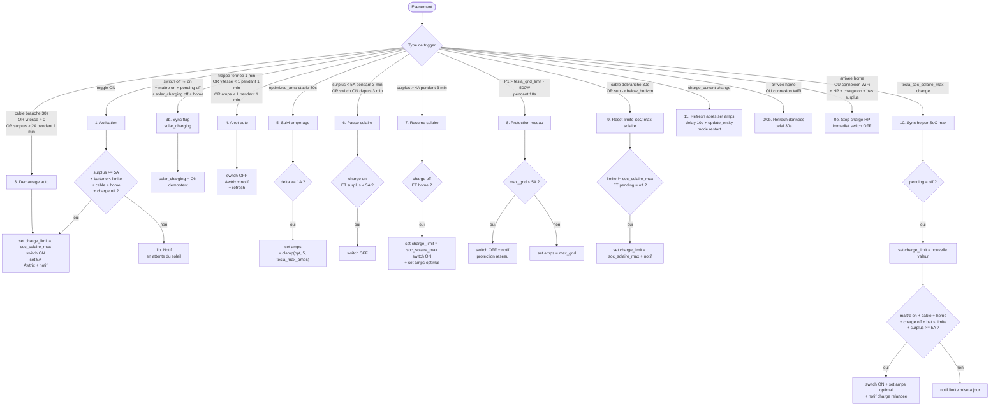
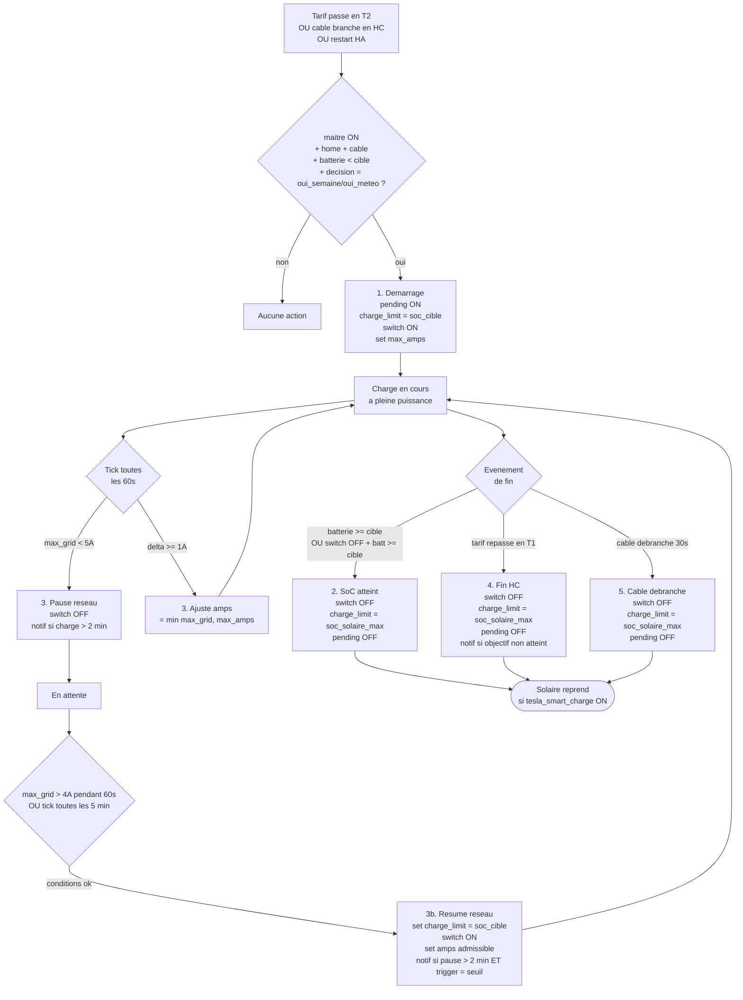

# Tesla Smart Charge

## Vue d'ensemble

Le systeme de recharge intelligente adapte en temps reel l'amperage de charge de la Tesla Model Y "F.R.I.D.A.Y" en fonction du surplus solaire disponible. L'objectif est de maximiser l'autoconsommation solaire et minimiser le soutirage reseau.

## Diagrammes

### 1. Matrice d'etats : qui controle la charge ?

Deux `input_boolean` determinent le mode actif. `tesla_smart_charge` est le maitre absolu (intention utilisateur), `tesla_night_charge_pending` est le verrou operationnel pose par la charge HC.


```mermaid
stateDiagram-v2
    direction LR
    [*] --> Manuel
    Manuel: Mode manuel total<br/>(app Tesla)
    Solaire: Smart Charge solaire<br/>actif
    HC: Charge HC en cours<br/>solaire en veille

    Manuel --> Solaire : tesla_smart_charge = ON<br/>(pending reste OFF)
    Solaire --> Manuel : tesla_smart_charge = OFF<br/>(pending OFF)
    Solaire --> HC : passage tarif T2<br/>+ batterie < cible<br/>+ decision = oui
    HC --> Solaire : SoC atteint<br/>ou retour tarif T1
    HC --> Manuel : cable debranche<br/>pendant charge HC
```

### 2. Flux decisionnel Smart Charge solaire

Les 11 automations du mode solaire s'enchainent autour de trois triggers (intention, evenement vehicule, surplus). Toutes partagent les gardes `tesla_smart_charge = on`, `pending = off`, `home`, sauf la protection reseau qui reagit plus vite. (Les automations 0, 0b, 0c, 0d et 0e sont des automations utilitaires, hors mode solaire.)


```mermaid
flowchart TD
    Start([Evenement]) --> Trig{Type de trigger}

    Trig -->|toggle ON| A1[1. Activation]
    Trig -->|cable branche 30s<br/>OR vitesse > 0<br/>OR surplus > 2A pendant 1 min| A3[3. Demarrage auto]
    Trig -->|switch off → on<br/>+ maitre on + pending off<br/>+ solar_charging off + home| A3b[3b. Sync flag<br/>solar_charging]
    Trig -->|trappe fermee 1 min<br/>OR vitesse < 1 pendant 1 min<br/>OR amps < 1 pendant 1 min| A4[4. Arret auto]
    Trig -->|optimized_amp stable 30s| A5[5. Suivi amperage]
    Trig -->|surplus < 5A pendant 3 min<br/>OR switch ON depuis 3 min| A6[6. Pause solaire]
    Trig -->|surplus > 4A pendant 3 min| A7[7. Resume solaire]
    Trig -->|P1 > tesla_grid_limit - 500W<br/>pendant 10s| A8[8. Protection reseau]
    Trig -->|cable debranche 30s<br/>OR sun -> below_horizon| A9[9. Reset limite SoC max solaire]
    Trig -->|tesla_soc_solaire_max change| A10[10. Sync helper SoC max]
    Trig -->|charge_current change| A11[11. Refresh apres set amps<br/>delay 10s + update_entity<br/>mode restart]
    Trig -->|arrivee home<br/>OU connexion WiFi| A0[0/0b. Refresh donnees<br/>delai 30s]
    Trig -->|arrivee home<br/>OU connexion WiFi<br/>+ HP + charge on + pas surplus| A0e[0e. Stop charge HP<br/>immediat switch OFF]

    A1 --> CondSurplus{surplus >= 5A<br/>+ batterie < limite<br/>+ cable + home<br/>+ charge off ?}
    CondSurplus -->|oui| DoStart[set charge_limit = soc_solaire_max<br/>switch ON<br/>set 5A<br/>Awtrix + notif]
    CondSurplus -->|non| NotifWait[1b. Notif<br/>en attente du soleil]

    A3 --> DoStart
    A3b --> SolarFlagOn[solar_charging = ON<br/>idempotent]
    A4 --> DoStop[switch OFF<br/>Awtrix + notif<br/>+ refresh]
    A5 --> CondDelta{delta >= 1A ?}
    CondDelta -->|oui| SetAmps["set amps<br/>= clamp(opt, 5, tesla_max_amps)"]
    A6 --> CondLow{charge on<br/>ET surplus < 5A ?}
    CondLow -->|oui| Pause[switch OFF]
    A7 --> CondResume{charge off<br/>ET home ?}
    CondResume -->|oui| Resume[set charge_limit = soc_solaire_max<br/>switch ON<br/>+ set amps optimal]
    A8 --> CondGrid{max_grid < 5A ?}
    CondGrid -->|oui| GridPause[switch OFF + notif<br/>protection reseau]
    CondGrid -->|non| GridReduce[set amps = max_grid]

    A9 --> CondReset{limite != soc_solaire_max<br/>ET pending = off ?}
    CondReset -->|oui| DoReset[set charge_limit = soc_solaire_max + notif]

    A10 --> CondSync{pending = off ?}
    CondSync -->|oui| DoSync[set charge_limit = nouvelle valeur]
    DoSync --> CanRelaunch{maitre on + cable + home<br/>+ charge off + bat < limite<br/>+ surplus >= 5A ?}
    CanRelaunch -->|oui| Relaunch[switch ON + set amps optimal<br/>+ notif charge relancee]
    CanRelaunch -->|non| NotifOnly[notif limite mise a jour]
```

### 3. Cycle de vie Charge Nocturne HC

La charge HC est pilotee par le tarif du P1 Meter HomeWizard (T1 = HP, T2 = HC). Le flag `tesla_night_charge_pending` met les automations solaires en veille tant qu'il est actif.


```mermaid
flowchart TD
    T2[Tarif passe en T2<br/>OU cable branche en HC<br/>OU restart HA] --> Eval{maitre ON<br/>+ home + cable<br/>+ batterie < cible<br/>+ decision = oui_semaine/oui_meteo ?}
    Eval -->|non| Idle[Aucune action]
    Eval -->|oui| StartHC[1. Demarrage<br/>pending ON<br/>charge_limit = soc_cible<br/>switch ON<br/>set max_amps]

    StartHC --> Run[Charge en cours<br/>a pleine puissance]

    Run --> Tick{Tick toutes<br/>les 60s}
    Tick -->|max_grid < 5A| GridPause[3. Pause reseau<br/>switch OFF<br/>notif si charge > 2 min]
    Tick -->|delta >= 1A| Adjust[3. Ajuste amps<br/>= min max_grid, max_amps]
    Adjust --> Run

    GridPause --> Wait[En attente]
    Wait --> Resume{max_grid > 4A pendant 60s<br/>OU tick toutes les 5 min}
    Resume -->|conditions ok| ResumeAct[3b. Resume reseau<br/>set charge_limit = soc_cible<br/>switch ON<br/>set amps admissible<br/>notif si pause > 2 min ET trigger = seuil]
    ResumeAct --> Run

    Run --> CheckEnd{Evenement<br/>de fin}
    CheckEnd -->|batterie >= cible<br/>OU switch OFF + batt >= cible| EndSoC[2. SoC atteint<br/>switch OFF<br/>charge_limit = soc_solaire_max<br/>pending OFF]
    CheckEnd -->|tarif repasse en T1| EndHP[4. Fin HC<br/>switch OFF<br/>charge_limit = soc_solaire_max<br/>pending OFF<br/>notif si objectif non atteint]
    CheckEnd -->|cable debranche 30s| EndCable[5. Cable debranche<br/>switch OFF<br/>charge_limit = soc_solaire_max<br/>pending OFF]

    EndSoC --> Done([Solaire reprend<br/>si tesla_smart_charge ON])
    EndHP --> Done
    EndCable --> Done
```

## Entites Tesla (Tessie)

### Entites utilisees dans la config actuelle

| Entite | Type | Description |
|---|---|---|
| `switch.f_r_i_d_a_y_recharge` | switch | Demarre/arrete la charge. **Sert aussi d'indicateur d'etat** : on = charge en cours |
| `number.f_r_i_d_a_y_courant_de_recharge` | number | Regle l'amperage cible (5-32A). **Valeur commandee** utilisee par les templates (plus fiable que le sensor Tessie poll toutes les ~30s) |
| `sensor.f_r_i_d_a_y_courant_du_chargeur` | sensor | Amperage reel de charge (A). Lecture Tessie, utilise seulement par le trigger `amps_too_low` de l'automation 4 |
| `sensor.f_r_i_d_a_y_niveau_de_la_batterie` | sensor | Niveau batterie (%) |
| `sensor.f_r_i_d_a_y_vitesse_de_recharge` | sensor | Vitesse de charge |
| `sensor.f_r_i_d_a_y_charge` | sensor | Statut de charge (Charging, Stopped, Disconnected, Complete...) |
| `number.f_r_i_d_a_y_limite_de_recharge` | number | Limite de charge configuree (%) |
| `device_tracker.f_r_i_d_a_y_emplacement` | device_tracker | Position (home/away) |
| `binary_sensor.f_r_i_d_a_y_cable_de_charge` | binary_sensor | Cable de charge branche (on = connected) |
| `cover.f_r_i_d_a_y_port_de_charge` | cover | Trappe de charge (ouvrir/fermer) |
| `sensor.f_r_i_d_a_y_puissance_du_chargeur` | sensor | Puissance de charge instantanee (kW). Lue par `sensor.power_tesla` (×1000 → W) |

### Entites Tessie disponibles mais NON utilisees dans les automations

L'integration Tessie expose de nombreuses entites supplementaires qui pourraient servir aux automatisations energie :

#### Charge et batterie

| Entite | Type | Description |
|---|---|---|
| `sensor.f_r_i_d_a_y_autonomie` | sensor | Autonomie estimee (km) |
| `sensor.f_r_i_d_a_y_energie_ajoutee_derniere_recharge` | sensor | Energie ajoutee cette session (kWh) |
| `sensor.f_r_i_d_a_y_vitesse_de_recharge` | sensor | Vitesse de charge (km/h ajoutes) |
| `sensor.f_r_i_d_a_y_tension_du_chargeur` | sensor | Tension chargeur (V) |
| `sensor.f_r_i_d_a_y_temps_avant_la_charge_complete` | sensor | Temps restant pour charge complete |
| `sensor.f_r_i_d_a_y_energy_remaining` | sensor | Energie restante dans la batterie (kWh) |
| `binary_sensor.f_r_i_d_a_y_cable_de_charge` | binary_sensor | Cable branche oui/non |
| `binary_sensor.f_r_i_d_a_y_recharge_planifiee` | binary_sensor | Charge programmee en attente |
| `lock.f_r_i_d_a_y_port_de_charge` | lock | Verrou du cable de charge |

#### Climat

| Entite | Type | Description |
|---|---|---|
| `climate.f_r_i_d_a_y_climatisation` | climate | Climatisation (pre-conditionnement) |
| `sensor.f_r_i_d_a_y_temperature_interieure` | sensor | Temperature interieure (C) |
| `sensor.f_r_i_d_a_y_temperature_exterieure` | sensor | Temperature exterieure (C) |
| `switch.f_r_i_d_a_y_degivrage` | switch | Degivrage |
| `select.f_r_i_d_a_y_siege_chauffant_gauche` | select | Siege chauffant avant gauche |
| `select.f_r_i_d_a_y_siege_chauffant_droit` | select | Siege chauffant avant droit |
| `select.f_r_i_d_a_y_siege_chauffant_arriere_gauche` | select | Siege chauffant arriere gauche |
| `select.f_r_i_d_a_y_siege_chauffant_arriere_droit` | select | Siege chauffant arriere droit |
| `switch.f_r_i_d_a_y_volant_chauffant` | switch | Volant chauffant |

#### Securite et controle

| Entite | Type | Description |
|---|---|---|
| `lock.f_r_i_d_a_y_verrouillage` | lock | Verrou portes |
| `switch.f_r_i_d_a_y_mode_sentinelle` | switch | Mode sentinelle |
| `binary_sensor.f_r_i_d_a_y_conducteur` | binary_sensor | Utilisateur present dans le vehicule |
| `button.f_r_i_d_a_y_appel_de_phares` | button | Flash des phares |
| `button.f_r_i_d_a_y_klaxon` | button | Klaxon |
| `cover.f_r_i_d_a_y_coffre_avant` | cover | Coffre avant |
| `cover.f_r_i_d_a_y_coffre_arriere` | cover | Coffre arriere |
| `update.f_r_i_d_a_y_mise_a_jour` | update | Mise a jour logicielle |

### Commandes Tessie (actions/services)

Tessie expose les commandes Tesla via des services HA standards (pas de domaine `tesla_fleet.` — tout passe par les entites Tessie) :

#### Commandes de charge

| Action | Service HA | Description |
|---|---|---|
| Demarrer la charge | `switch.turn_on` sur `switch.f_r_i_d_a_y_recharge` | Demarre la charge |
| Arreter la charge | `switch.turn_off` sur `switch.f_r_i_d_a_y_recharge` | Arrete la charge |
| Regler l'amperage | `number.set_value` sur `number.f_r_i_d_a_y_courant_de_recharge` | Modifie l'amperage (0-32A) |
| Regler la limite SoC | `number.set_value` sur `number.f_r_i_d_a_y_limite_de_recharge` | Modifie la limite SoC (50-100%) |
| Ouvrir le port de charge | `cover.open_cover` sur `cover.f_r_i_d_a_y_port_de_charge` | Ouvre la trappe |
| Fermer le port de charge | `cover.close_cover` sur `cover.f_r_i_d_a_y_port_de_charge` | Ferme la trappe |

#### Commandes de planification (firmware >= 2024.26)

| Commande API | Description |
|---|---|
| `set_scheduled_charging` | Programme une charge (enable, time en min depuis minuit). **Deprecie depuis 2024.26** |
| `set_scheduled_departure` | Programme un depart (heure, precond, off-peak). **Deprecie depuis 2024.26** |
| `add_charge_schedule` | **Nouveau** : Ajoute un planning de charge (jours, heure debut/fin, localisation) |
| `remove_charge_schedule` | **Nouveau** : Supprime un planning de charge |
| `add_precondition_schedule` | **Nouveau** : Ajoute un planning de pre-conditionnement |
| `remove_precondition_schedule` | **Nouveau** : Supprime un planning de pre-conditionnement |

Les nouvelles commandes `add_charge_schedule` / `add_precondition_schedule` (firmware 2024.26+) permettent :
- **Multiples plannings** par localisation (Maison, Travail, etc.)
- **Jours specifiques** de la semaine
- **Heure de debut ET de fin** (utile pour arreter avant les heures pleines)
- **Recurrent ou ponctuel**
- Remplacement de l'ancien systeme `set_scheduled_charging`/`set_scheduled_departure`

#### Commandes climat

| Commande API | Description |
|---|---|
| `auto_conditioning_start` | Demarre la climatisation a distance |
| `auto_conditioning_stop` | Arrete la climatisation |
| `set_temps` | Regle la temperature cible |
| `set_preconditioning_max` | Pre-conditionnement max (degivrage) |

#### Commandes navigation

| Commande API | Description |
|---|---|
| `navigation_gps_request` | Envoie des coordonnees GPS au vehicule |
| `navigation_sc_request` | Navigue vers un Supercharger |
| `navigation_request` | Envoie une adresse au vehicule |

### Input booleans

- **`input_boolean.tesla_smart_charge`** : Maitre absolu — active/desactive TOUTE la recharge automatique (solaire ET HC). OFF = mode manuel total via l'app Tesla.
- **`input_boolean.awtrix_toggle_tesla_charge`** : Active l'affichage charge sur Awtrix

## Algorithme de calcul du surplus

Defini dans `template_sensors/tesla_smart_charge.yaml` :

**Installation triphasee** : le Wall Connector Tesla est branche sur les 3 phases (3x230V sans neutre). L'app Tesla affiche "3" pendant la charge. La puissance reelle est donc :

```
P_total = sqrt(3) * V_ligne * I_phase    (cos phi ~= 1 pour charge AC Tesla)
I_phase = P_total / (sqrt(3) * V_ligne)
```

A titre de reference : 16A triphase ≈ 6 375 W, 28A triphase ≈ 11 150 W, 40A triphase ≈ 15 930 W (limite installation).

### sensor.tesla_optimized_amp

```
voltage    = tension mesuree P1 meter L1 (defaut 230V)
p1_power   = puissance active P1 totale triphasee (positif=soutirage, negatif=injection)
tesla_amps = number.f_r_i_d_a_y_courant_de_recharge (A par phase, commandee HA)
             0 si switch OFF OU cable OFF (valeur obsolete au rebranchement)
sqrt3      = 1.732

tesla_power = sqrt3 * voltage * tesla_amps     # W total triphase
surplus_w   = -p1_power + tesla_power          # W total triphase
optimal_amp = surplus_w / (sqrt3 * voltage)    # A par phase

=> clamp(optimal_amp, 0, max_grid)
   (max_grid integre deja la borne haute input_number.tesla_max_amps)
```

**Note** : plus de garde sur `solar < 50W`. Le signe de `p1_power` suffit a detecter l'injection solaire (pas d'autre injecteur sur l'installation). Quand la charge demarre sans soleil, l'automation 6 la met en pause au bout de 3 min via son 2e trigger (`switch = on depuis 3 min`).

### sensor.tesla_max_amp_grid

```
voltage      = tension mesuree P1 meter L1 (defaut 230V)
p1_power     = puissance active P1 totale triphasee (positif=soutirage, negatif=injection)
tesla_amps   = number.f_r_i_d_a_y_courant_de_recharge (A par phase, commandee HA)
               0 si switch OFF OU cable OFF
grid_limit   = input_number.tesla_grid_limit (defaut 15500W, triphase sans neutre 40A)
max_user_amps = input_number.tesla_max_amps (defaut 28A, configurable UI)
margin       = 500W (marge de securite)
sqrt3        = 1.732

tesla_power = sqrt3 * voltage * tesla_amps       # W total triphase
other_power = p1_power - tesla_power             # consommation hors Tesla (W total)
headroom_w  = grid_limit - margin - other_power
max_amps    = headroom_w / (sqrt3 * voltage)     # A par phase

=> clamp(max_amps, 0, max_user_amps)
```

**Choix de `tesla_amps`** : les templates utilisent la valeur **commandee** (`number.f_r_i_d_a_y_courant_de_recharge`) plutot que la valeur **lue** (`sensor.f_r_i_d_a_y_courant_du_chargeur`). Le sensor Tessie est poll toutes les ~30s, ce qui provoque des oscillations dans les calculs. La garde `switch=on ET cable=on` force `tesla_amps = 0` quand la Tesla ne charge pas, pour eviter une valeur obsolete au rebranchement.

**Logique** : Calcule combien d'amperes la Tesla peut consommer sans que le soutirage total depasse la limite du compteur (`input_number.tesla_grid_limit` - 500W marge). La borne haute est `input_number.tesla_max_amps` (defaut 28A, configurable depuis l'UI). Installation triphase sans neutre 40A → max theorique ~15 930W, limite par defaut 15 500W. Utilise comme plafond par `tesla_optimized_amp` et par le suivi amperage nocturne.

### Interaction des deux sensors

`tesla_optimized_amp` utilise un **double plafond** : `min(surplus_solaire, max_grid)`. Ainsi l'amperage ne depasse jamais ni le surplus solaire ni la capacite reseau.

**Logique surplus** : Le surplus disponible correspond a ce que la Tesla consomme deja + ce qu'on injecte dans le reseau (ou - ce qu'on soutire). Divise par la tension, on obtient l'amperage optimal.

## Architecture des automations

Toute la logique est dans un fichier unique : `automation/TeslaSmartCharge.yaml` (18 automations)

### Concepts cles

- **`input_boolean.tesla_smart_charge`** = **maitre absolu** (intention utilisateur) — conditionne toute recharge automatique, solaire ET HC. Jamais modifie par les automations.
- **`input_boolean.tesla_night_charge_pending`** = **verrou operationnel HC** — mis a ON par l'evaluation 21h, remis a OFF a la fin de la charge HC. Les automations solaires le verifient (`= off`) pour se mettre en veille pendant la charge HC sans toucher au maitre.
- **`switch.f_r_i_d_a_y_recharge`** = la charge **tourne reellement** (etat)
- **`script.tesla_refresh`** = reveille la voiture et force la mise a jour des capteurs cles (batterie, vitesse de charge, courant). Centralise le pattern wake+delay+update, utilise par 6 automations
- **`script.tesla_update_no_wake`** = force un poll Tessie sans wake (rafraichit courant_du_chargeur, limite_de_recharge, cable_de_charge, etat). Utile pour bouton dashboard quand la voiture est deja en ligne — pas de consommation 12V
- Le suivi amperage est toujours actif, ses conditions internes l'empechent d'agir quand la charge est arretee

### Les 17 automations

```
0. Refresh donnees (arrivee a la maison via Tessie GPS) :
   Trigger: device_tracker.f_r_i_d_a_y_emplacement -> home
   Action: delay 30s + script.tesla_refresh
   (wake + force poll Tessie quand la voiture rentre)

0b. Refresh donnees (connexion WiFi via Netgear) :
   Trigger: device_tracker.tesla_y -> home
   Action: delay 30s + script.tesla_refresh
   (declenche au plus tot apres l'entree au garage, complete l'auto 0)

0c. Refresh sur saut de conso (desync charge demarree) :
   Trigger: sensor.p1_power_delta_2min > 3000 W
   Conditions: f_r_i_d_a_y_status on + charging != charging/starting
   Action: script.tesla_update_no_wake
   (detecte un demarrage de charge non encore vu par Tessie :
    saut de conso maison + voiture awake + Tessie dit pas charge -> poll force)

0d. Refresh sur chute de conso (desync charge arretee) :
   Trigger: sensor.p1_power_delta_2min < -3000 W
   Conditions: f_r_i_d_a_y_etat on + emplacement home (GPS OU WiFi) + charge in charging/starting
   Action: script.tesla_update_no_wake
   (symetrique de 0c : detecte un arret de charge non encore vu par Tessie)

0e. Stop charge HP a l'arrivee (GPS ou WiFi) :
   Trigger: device_tracker.f_r_i_d_a_y_emplacement -> home
            OU device_tracker.tesla_y -> home
   Conditions: HC pending off + tarif HP (T1) + charge on + tesla_optimized_amp < 5A
   Action: switch.turn_off + input_boolean.turn_on(tesla_smart_charge) + notification
   Note: reaction immediate (pas de delai). Complement de l'auto 6 qui necessite
         3 min de charge active avant d'agir. La Tesla peut demarrer seule au
         branchement avant que HA la detecte (lag Tessie ~1-2 min).
         Pas de condition sur location = home (si WiFi trigger, GPS peut encore
         etre away).
         Active automatiquement le mode solaire : l'auto 3 (trigger power_available)
         relancera la charge des que tesla_optimized_amp > 2A pendant 1 min.
         turn_on est idempotent — si le maitre etait deja actif, pas d'effet.

input_boolean.tesla_smart_charge (MAITRE)
       |
       +--[ON] + tesla_night_charge_pending=OFF --> 1. Activation solaire
       |            Conditions: home + cable branche + charge off + batterie pas pleine + surplus >= 5A
       |            Si OK --> set charge_limit = tesla_soc_solaire_max
       |                       + switch.turn_on + set 5A + Awtrix + notification
       |            Sinon --> notification "en attente du soleil"
       |
       +--[ON] + tesla_night_charge_pending=ON  --> charge HC active, automations solaires en veille
       |
       +--[OFF]--> 2. Desactivation
                     Condition: HC pending off (ne coupe pas une charge nocturne en cours)
                     Si charge en cours --> switch.turn_off + Awtrix + notification
                     Sinon --> rien

3. Demarrage auto (solaire) :
  Triggers:
    - manual_start   : vitesse_de_charge > 0
    - charger_plugin : charge_cable = on pendant 30s
    - power_available: tesla_optimized_amp > 2 pendant 1 min
  Conditions: maitre on + HC pending off + home (GPS OU WiFi) + charge off + batterie pas pleine
              + derniere `tesla_smart_charge_pause_surplus_insuffisant` > 5 min
                (entity_id reel de l'auto 6 dans la registry HA)
                (anti-doublon : si auto 6 vient de pauser, laisse Resume #7
                 gerer la reprise — seuils plus robustes : 4A pendant 3 min)
  --> script.tesla_refresh + set charge_limit = tesla_soc_solaire_max
      + switch.turn_on + set 5A + Awtrix + notification (message selon trigger.id)

3b. Sync flag solar_charging (charge demarree hors auto 3) :
  Trigger: switch.f_r_i_d_a_y_recharge off → on
  Conditions: maitre on + HC pending off + solar_charging off + home (GPS OU WiFi)
  --> input_boolean.turn_on(tesla_solar_charging)
      + awtrix_toggle_tesla = OFF (affichage charge)
      + notification "Smart Charge detecte (charge demarree par la voiture)"
  Note: complement de l'auto 3 — positionne le flag quand la Tesla demarre la charge
        automatiquement (auto-charge native) avant que le trigger charger_plugin (30s)
        n'ait pu faire executer l'auto 3.
        Ne fire PAS dans le cas normal (auto 3 pose solar_charging AVANT switch.turn_on
        depuis cette version — voir ordre des actions autos 1 et 3) : la condition
        solar_charging=off est fausse quand c'est auto 3 qui demarre.
        Ne fire QUE si c'est la voiture qui a demarre seule. Dans ce cas il envoie
        la notification et met a jour l'Awtrix.
        Sans ce filet, solar_charging resterait OFF → auto 7 (Resume) ne pourrait
        pas reprendre apres une pause solaire.

4. Arret auto (solaire) :
  Triggers:
    - charger_plugout: trappe_de_charge = closed pendant 1 min
    - manual_stop    : vitesse_de_charge < 1 pendant 1 min
    - amps_too_low   : charger_current < 1 pendant 1 min
  Conditions: maitre on + HC pending off + charge on
  --> switch.turn_off + Awtrix + notification (message selon trigger.id) + script.tesla_refresh

5. Suivi amperage solaire (state-change avec garde de stabilite) :
  Trigger: sensor.tesla_optimized_amp stable depuis 30s
  Conditions: maitre on + HC pending off + charge on + home (GPS OU WiFi) + delta >= 1A
  --> number.set_value(clamp(optimized_amp, 5, tesla_max_amps))
  Note: 30s aligne sur le polling Tessie (~30s) — plancher pertinent.
        Reagit aux vraies variations, ignore les oscillations < 30s.

6. Pause solaire :
  Triggers:
    - tesla_optimized_amp < 5 pendant 3 min (surplus qui chute en cours de charge)
    - switch.f_r_i_d_a_y_recharge = on depuis 3 min (demarrage sans soleil : pas de transition detectable)
  Conditions: maitre on + HC pending off + charge on + home (GPS OU WiFi) + tesla_optimized_amp < 5
  --> switch.turn_off (temporaire)

7. Resume solaire :
  Trigger: tesla_optimized_amp > 4 pendant 3 min
  Conditions: maitre on + HC pending off + charge off + home (GPS OU WiFi)
  --> set charge_limit = tesla_soc_solaire_max + switch.turn_on + set amperage optimal
  Note: re-applique la limite avant turn_on (defense contre une derive
        cote Tesla pendant la pause : commande Tessie perdue avec
        voiture endormie, modif manuelle via app, etc.).

8. Protection reseau (reaction rapide, charge solaire uniquement) :
  Trigger: template — p1_active_power > (tesla_grid_limit - 500W) pendant 10s
           (defaut 15 500W - 500W = 15 000W)
  Conditions: HC pending off + charge on + home (GPS OU WiFi)
  Si max_grid < 5A --> pause charge + notification
  Sinon --> reduit amperage au max admissible
  Note: la charge nocturne a sa propre gestion reseau (voir automations 3 et 3b)

9. Reset limite + solar_charging :
  Triggers:
    - cable    : binary_sensor.f_r_i_d_a_y_cable_de_charge = off pendant 30s
    - nuit     : sun.sun = below_horizon
  Conditions: HC pending = off
              ET (limite != tesla_soc_solaire_max OU solar_charging = on)
  --> if limite differente : set charge_limit = tesla_soc_solaire_max  (evite appel Tessie inutile)
  --> toujours : solar_charging = OFF + notification (raison, batterie, limite)
  Note: le OR sur solar_charging est indispensable — en charge solaire normale,
        la limite est deja a soc_solaire_max des le demarrage. Sans le OR,
        la condition "limite differente" serait fausse et solar_charging resterait
        bloque a ON apres debranchement (bug confirme : solar_charging est reste ON
        9h le 2026-05-21 alors que la voiture etait absente, exposant l'auto 7
        Resume a envoyer des commandes a la voiture a distance).
        sun.sun plutot que tarif T2 — la HC midi (11h-17h) ne doit pas resetter
        la limite alors que le surplus est encore exploitable.

10. Sync helper tesla_soc_solaire_max :
  Trigger: state change input_number.tesla_soc_solaire_max
  Condition: HC pending = off
  --> set charge_limit = nouvelle valeur du helper
  --> si maitre on + cable + home (GPS OU WiFi) + charge off + batterie < limite + surplus >= 5A
      → switch.turn_on + set amps optimal + notif "charge relancee"
      sinon → notif "limite mise a jour"
  Note: relance immediate sans hysteresis (intention utilisateur explicite).
        Bloquee pendant HC : la HC utilise tesla_soc_cible, le helper sera
        applique automatiquement par les auto 2/4/5 a la fin HC.

11. (Supprimee) Refresh donnees apres set amperage :
  Generait 5 appels Fleet API apres chaque set_value amperage → depassement quota.
  Avec Tessie : pas de quota direct — Tessie gere le polling Tesla de son cote.
  Le coordinator Tessie poll automatiquement toutes les ~30s quand la voiture est eveilee.
```

## Scenarios d'arrivee et demarrage de charge

Cette matrice couvre tous les cas possibles quand la voiture rentre et se branche, en fonction du tarif, du surplus et de l'etat du switch vu par HA au moment de l'arrivee.

| # | Scenario | Tarif | Surplus | switch (HA) | Chaine d'automations | solar_charging |
|---|---|---|---|---|---|---|
| 1 | Arrivee + cable branche (Tessie pas encore mis a jour) | HP/HC | any | OFF | `charger_plugin` 30s → auto 3 | ON ✓ |
| 2 | Arrivee + Tesla demarre seule en < 30s (Tessie rapide) | HP | any | OFF→ON | transition switch → auto 3b | ON ✓ |
| 3 | Arrivee HP, switch deja ON, pas de surplus | HP | < 5A | ON | auto 0e : stoppe + smart_charge ON → `power_available` → auto 3 | ON ✓ |
| 4 | Arrivee en HC (night_charge_pending = ON) | HC | any | any | automations solaires bloquees (pending = ON) | N/A ✓ |
| 5 | Voiture deja home, cable branche, surplus atteint le seuil | HP | > 2A for 1 min | OFF | `power_available` → auto 3 | ON ✓ |

**Cas limite residuel (tres rare)** : si la voiture arrive avec switch = ON stale dans HA ET que le refresh des autos 0/0b n'est pas encore effectue ET que l'utilisateur branche le cable dans les < 90s suivant l'arrivee, aucune transition `off→on` n'est detectee. Dans ce cas, l'auto 6 (Pause solaire, trigger `switch ON depuis 3 min`) detecra l'absence de surplus et mettra en pause ; solar_charging restera OFF jusqu'a un prochain `off→on`. En pratique, le refresh des autos 0/0b precede le branchement manuel (30s minimum de delai).

**Complement auto 3 / auto 3b** : les deux automations sont mutuellement exclusives grace a l'ordre des actions.
- Auto 3 pose `solar_charging = ON` **avant** `switch.turn_on`. Quand le switch passe ON, auto 3b voit `solar_charging = ON` → sa condition echoue → elle ne fire pas.
- Auto 3b ne fire que si `solar_charging` est encore OFF au moment ou le switch passe ON : c'est le cas quand la Tesla a demarre la charge seule (avant le delai de 30s du trigger `charger_plugin`). Dans ce cas auto 3b prend le relais : flag + Awtrix + notification.
Pas de doublon possible : une seule des deux automations envoie une notification par session.

## Protections integrees

| Protection | Mecanisme |
|---|---|
| **Pas de quota direct (Tessie)** | Tessie gere le polling Tesla — pas de quota HA a surveiller. Garde conservee : trigger stable 30s + delta >= 1A. Auto 11 supprimee (etait la principale source de depassement quota Fleet API). Cooldown 120s supprime (n'etait utile que pour limiter les appels Fleet API). |
| **Anti-flapping** | Hystéresis 3 min avant pause/resume |
| **Micro-ajustements** | Commande envoyee seulement si delta >= 1A |
| **Minimum amperage** | 5A minimum (contrainte Tesla) |
| **Maximum amperage** | 28A maximum (limite installation, configurable via `input_number.tesla_max_amps`) |
| **Pas de soleil** | Detection via le signe de `p1_power` (negatif = injection). Si la charge demarre sans surplus, l'automation 6 la met en pause au bout de 3 min (trigger `switch=on depuis 3 min`) |
| **Geolocalisation** | Uniquement quand la voiture est a la maison — condition `or` : `device_tracker.f_r_i_d_a_y_emplacement` (Tessie GPS) OU `device_tracker.tesla_y` (WiFi Netgear) |
| **Arret HP a l'arrivee** | Auto 0e coupe immediatement la charge si arrivee en HP sans surplus solaire, **puis active tesla_smart_charge** pour que l'auto 3 reprenne la charge automatiquement quand le soleil devient suffisant. Lag Tessie ~1-2 min : reagit des que GPS ou WiFi detecte l'arrivee |
| **Limite compteur** | `sensor.tesla_max_amp_grid` plafonne l'amperage a la capacite reseau (`tesla_grid_limit` - 500W marge) |
| **Protection rapide** | Automation 8 reagit en < 20s si soutirage > (`tesla_grid_limit` - 500W marge), defaut 15 000W |
| **Arret HC precis au %** | Auto 1 force `limite_de_recharge = soc_cible` au demarrage HC : la voiture s'arrete nativement a la cible (independant du polling Tessie). La limite est restauree a `tesla_soc_solaire_max` par les auto 2/4/5 a la fin HC |

## Affichage Awtrix

L'automation **Awtrix Tesla Charging** affiche sur l'afficheur LED :
- Amperage actuel de charge
- Barre de progression : % batterie / limite de charge configuree
- Icone Tesla (1018)

## Flux de donnees

```
[P1 Meter]     --> active_power + active_voltage_l1 --|-----> sensor.tesla_max_amp_grid
[HA commande]  --> number.f_r_i_d_a_y_courant_de_recharge --|            |
                   (garde: switch=on ET cable=on sinon 0)           |
                                                       v            v
                                     sensor.tesla_optimized_amp (double cap: solaire + reseau)
                                                  |
                                5. Suivi amperage (state-change + 30s stable) --- normal
                                8. Protection reseau (10s) --- urgence (> 14 500W)
                                                  |
                                number.set_value (number.f_r_i_d_a_y_courant_de_recharge)
                                                  |
                                         [Tessie API → Tesla]
```

`sensor.solar_total` (defini dans `power_and_energy.yaml` avec unique_id `sensor.solar_total_power` mais entity_id derive du nom) sert uniquement aux notifications. Il n'intervient plus dans le calcul de l'amperage optimal — le signe de `p1_power` suffit.

## Charge HC (heures creuses)

### Contexte

- **Semaine** : la voiture est au travail en journee, pas de charge solaire possible → charge HC si batterie < SoC cible
- **Weekend** : la voiture est a la maison → charge solaire en journee, charge HC seulement si previsions solaires insuffisantes
- **Detection HC/HP** : basee sur le tarif actif du P1 Meter HomeWizard (`sensor.p1_meter_3c39e7284d28_active_tariff`), pas sur des horaires codes en dur. Valeur 1 = HP (T1), valeur 2 = HC (T2)
- **Horaires HC Wallonie 2026** : 22h-07h + 11h-17h (tous les jours). Les deux plages sont utilisees pour la charge (nocturne et midi)

### Input helpers

| Input | Description | Defaut |
|---|---|---|
| `input_number.tesla_soc_cible` | SoC minimum garanti chaque matin (cible HC) | 50% |
| `input_number.tesla_soc_solaire_max` | SoC max en mode solaire (force au demarrage des autos 1/3 SmartCharge) | 90% |
| `input_number.tesla_seuil_solaire` | Production solaire prevue en-dessous de laquelle on charge la nuit | 40 kWh |
| `input_number.tesla_max_amps` | Amperage max de l'installation | 28A |
| `input_number.tesla_grid_limit` | Limite puissance compteur (W) | 15 500W |
| `input_boolean.tesla_night_charge_pending` | Flag : charge nocturne programmee (gere par l'automation) | off |

### Template sensors

Definis dans `template_sensors/tesla_night_charge.yaml` :

| Sensor | Description |
|---|---|
| `sensor.tesla_heures_creuses` | Indique si on est en HC (true/false), base sur le tarif actif du P1 Meter HomeWizard |
| `sensor.tesla_charge_nocturne_necessaire` | Decision : `oui_semaine`, `oui_meteo`, `non`, `non_solaire_suffisant`, `impossible` |
| `sensor.tesla_duree_charge_nocturne_estimee` | Estimation en minutes pour atteindre le SoC cible |

### Automations (automation/TeslaNightCharge.yaml)

Sept automations (6 + 1 sync helper). L'evaluation de `tesla_charge_nocturne_necessaire` se fait **au moment du demarrage** (transition tarif ou branchement en HC), pas a heure fixe. Le flag `pending` est active a ce moment-la et sert de verrou pour les automations solaires.

```
1. Demarrage HC :
  Triggers:
    - tariff  : sensor.p1_meter_3c39e7284d28_active_tariff passe a '2' (HC)
    - cable   : binary_sensor.f_r_i_d_a_y_cable_de_charge = on pendant 30s
    - restart : homeassistant.event = start
  Conditions: maitre on + tarif=2 + home (GPS OU WiFi) + cable + batterie < cible
              + (trigger=restart ET pending=on)
                OU sensor.tesla_charge_nocturne_necessaire IN ['oui_semaine','oui_meteo']
  Action: pending ON + script.tesla_refresh
          + number.f_r_i_d_a_y_limite_de_recharge = soc_cible (arret natif Tesla)
          + switch.turn_on + set max_amps + notif
  Note: se declenche sur toutes les plages HC (nocturne et midi).
        Restart HA : reprend la charge si pending etait deja actif.
        La limite Tesla est forcee a la cible : la voiture s'arrete
        nativement (precis au %) sans dependre du polling Fleet API
        (sensor batterie souvent fige la nuit).

2. Arret - SoC atteint :
  Triggers:
    - batt       : sensor batterie >= SoC cible (trigger template)
    - switch_off : switch.f_r_i_d_a_y_recharge passe a off
                   (voiture arretee seule a charge_limit native)
  Conditions: pending on + sensor batterie >= SoC cible
              (filtre les pauses reseau et cable debranche)
  Action: switch.turn_off + charge_limit = 80 + pending OFF + notification
  Note: le 2e trigger libere pending des que la voiture s'arrete
        seule, sans attendre le polling du sensor batterie. Critique
        en plage HC midi pour ne pas bloquer le smart charge solaire.

3. Suivi reseau (toutes les 60s) :
  Conditions: pending on + charge on
  Si max_grid < 5A --> pause charge (switch off)
                       Notif uniquement si charge tournait > 2 min
                       (silence les oscillations autour du seuil)
  Sinon si delta >= 1A --> ajuste amperage a min(max_grid, max_amps)
                           (remonte quand la consommation baisse)

3b. Resume reseau :
  Triggers:
    - seuil      : max_grid > 4A pendant 60s (sortie de saturation)
    - periodique : toutes les 5 min (filet de securite)
  Conditions: pending on + charge off + home (GPS OU WiFi) + tarif HC
  Action: set charge_limit = tesla_soc_cible + switch.turn_on
          + set amperage au max admissible
          Notif uniquement si trigger=seuil ET pause > 2 min
          (silence le filet periodique et les micro-coupures)
  Note: re-applique la cible HC avant turn_on (meme defense que
        SmartCharge auto 7 contre la derive Tesla).

4. Arret - Retour HP :
  Trigger: sensor.p1_meter_3c39e7284d28_active_tariff repasse a '1' (HP)
  Conditions: pending on
  Action: arrete charge si encore en cours + charge_limit = tesla_soc_solaire_max + pending OFF
  Notification si objectif non atteint
  Note: charge_limit restauree par securite (filet si auto 2 ratee).

5. Cable debranche :
  Trigger: binary_sensor.f_r_i_d_a_y_cable_de_charge = off pendant 30s
  Conditions: pending on
  Action: switch.turn_off + charge_limit = tesla_soc_solaire_max + pending OFF + notification
  Evite que resume reseau tente de relancer en boucle jusqu'a la fin HC.
  Restaure aussi charge_limit a tesla_soc_solaire_max : sinon la prochaine
  charge solaire serait plafonnee a la cible HC.

6. Sync helper tesla_soc_cible :
  Trigger: state change input_number.tesla_soc_cible
  Conditions: pending on
  Action: set charge_limit = nouvelle cible + notification
  Note: bloquee hors charge HC. La nouvelle cible sera utilisee au
        prochain demarrage HC par auto 1.
```

**Avantage du sensor tarif** : les transitions HC/HP sont detectees directement par le compteur P1 Meter HomeWizard. Si les horaires changent cote gestionnaire de reseau, les automations s'adaptent automatiquement sans modification.

**Protection reseau nocturne** : La charge nocturne tourne a pleine puissance (28A). Le suivi reseau (60s) reduit l'amperage si un gros consommateur s'allume. Si la grille est saturee (max_grid < 5A), la charge est mise en pause et le resume reseau la relance des que le surplus revient. L'automation 8 (SmartCharge) est filtree par `HC pending off` — la charge nocturne a sa propre gestion reseau independante.

### Integration avec le smart charge solaire

La cohabitation solaire/HC repose sur `input_boolean.tesla_night_charge_pending` :
- `tesla_smart_charge` (maitre) n'est **jamais modifie** par les automations HC
- Quand `tesla_night_charge_pending = on`, toutes les automations solaires (1, 1b, 2, 3, 3b, 4, 5, 6, 7, 8) ont une condition `pending = off` → elles se mettent en veille automatiquement
- Quand la charge HC se termine (SoC atteint ou retour HP), `tesla_night_charge_pending` repasse a off → le smart charge solaire reprend si `tesla_smart_charge` est toujours on
- Le weekend, si la prevision solaire est suffisante (>= seuil), la charge HC ne se declenche pas et le smart charge solaire prend le relais

| `tesla_smart_charge` | `tesla_night_charge_pending` | Mode actif |
|---|---|---|
| OFF | — | Manuel total (app Tesla) |
| ON | OFF | Smart charge solaire |
| ON | ON | Charge HC, solaire en veille |

## Notifications

Les notifications sont envoyees a Fabien via `script.notify_fabien` avec des details enrichis :

| Evenement | Contenu |
|---|---|
| Smart Charge demarre (auto 3) | Raison (cable/solaire/manuel), batterie %, limite %, production solaire W |
| Smart Charge detecte (auto 3b) | Charge demarree par la voiture elle-meme (auto-charge native) — batterie %, limite % |
| Smart Charge arrete | Raison (debranche/manuel/termine), batterie %, energie ajoutee kWh |
| Smart Charge active/desactive | Batterie %, limite %, production solaire W, energie ajoutee |
| Charge HC demarree | Raison (semaine/meteo), batterie actuelle → cible, amperage, duree estimee, prevision solaire |
| Charge HC SoC atteint | Batterie % |
| Charge HC fin (retour HP) | Batterie %, objectif non atteint si applicable |
| Charge HC pause reseau | Soutirage sature — uniquement si charge tournait > 2 min |
| Charge HC reprise reseau | Duree de pause et amperage — uniquement si pause > 2 min (sortie franche) |
| Charge HC cable debranche | Batterie %, objectif — deconnexion pendant la charge |
| Smart Charge reset limite + solar_charging | Cable debranche OU coucher du soleil. Remet `solar_charging=OFF` et (si besoin) restaure `tesla_soc_solaire_max`. Batterie %, limite % |
| Smart Charge sync helper SoC max | Helper modifie depuis le dashboard, charge_limit aligne (et charge relancee si conditions OK) |
| Charge HC sync helper SoC cible | Cible HC modifiee pendant charge HC, charge_limit aligne |
| Arret HP a l'arrivee | Charge coupee immediatement (heures pleines, pas de surplus), batterie %. Mode solaire active — reprendra automatiquement des que le surplus est suffisant |
| Protection reseau solaire | Soutirage > (`tesla_grid_limit` - 500W), pause charge (solaire uniquement) |

## Pistes d'amelioration restantes

1. **Integration prix spot** : Si tarif dynamique (Belpex), charger quand le prix est bas
2. **Priorite electromenager** : Reduire la charge Tesla quand la machine a laver ou le seche-linge tournent (sensors existants : `binary_sensor.machine_a_laver_en_cours`, `binary_sensor.sechoir_en_cours`)
3. **Historique et stats** : Tracker l'energie chargee en solaire vs reseau via `sensor.f_r_i_d_a_y_energie_ajoutee_derniere_recharge`
4. **Pre-conditionnement intelligent** : Utiliser `climate.f_r_i_d_a_y_climatisation` ou `auto_conditioning_start` pour chauffer/refroidir l'habitacle avant depart (basee sur le trajet matin Waze)

### Fichiers

| Fichier | Contenu |
|---|---|
| `automation/TeslaSmartCharge.yaml` | Smart charge solaire : 18 automations (incl. stop HP arrivee, sync flag solar_charging, refresh WiFi Netgear, refresh sur saut/chute conso, protection reseau, reset + sync helper SoC max) |
| `automation/TeslaNightCharge.yaml` | Charge HC (tarif P1 Meter) : 7 automations (incl. suivi reseau, cable debranche, sync helper cible) |
| `script/tesla_refresh.yaml` | Scripts utilitaires : `tesla_refresh` (wake + poll Tessie 10s) et `tesla_update_no_wake` (poll Tessie sans wake) |
| `template_sensors/tesla_smart_charge.yaml` | Calcul `sensor.tesla_optimized_amp` et `sensor.tesla_max_amp_grid` |
| `template_sensors/power_and_energy.yaml` | Definit `sensor.solar_total` (unique_id `sensor.solar_total_power`) utilise par les notifs |
| `template_sensors/tesla_night_charge.yaml` | Decision charge HC, detection tarif, duree estimee |
| `automation/AwtrixTeslaCharge.yaml` | Affichage Awtrix |
| `configuration.yaml` | Input helpers (SoC cible HC, SoC max solaire, seuil solaire, max amps, grid limit, flag nocturne) |

### Notes

- **Integration** : Tessie (remplace Tesla Fleet API depuis 2026-05-30). Vehicule : F.R.I.D.A.Y. — prefixe entites `f_r_i_d_a_y_`. Tessie gere le quota Tesla de son cote, pas de limite HA.
- Les conditions de geolocalisation acceptent `device_tracker.f_r_i_d_a_y_emplacement` (Tessie GPS) OU `device_tracker.tesla_y` (WiFi Netgear) — la premiere arrivee l'emporte
- Detection cable branche via `binary_sensor.f_r_i_d_a_y_cable_de_charge`
- Amperage max borne a 28A (limite installation), configurable via `input_number.tesla_max_amps`
- Previsions solaires via integration Forecast.Solar (`sensor.energy_production_tomorrow`)
